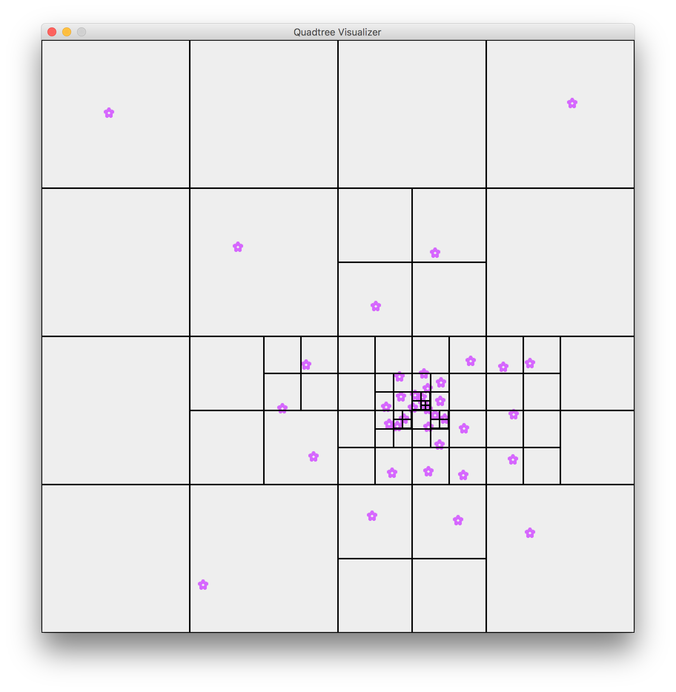

# ThreadSafe Quadtree & Visualizer

## Running the program

```bash
git clone https://github.com/matthewfaller/ConcurrentQuadtrees.git
```

```bash
cd ConcurrentQuadtrees/
```

```bash
java -jar Visualizer.jar
```

## Using the visualizer

> Click an empty space to place an item

> Click an item to remove it

